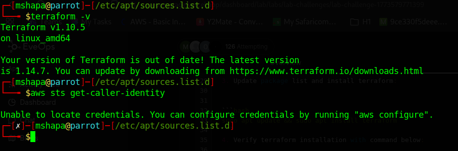

## Day 1 Activities
### Created AWS account:
1. AWS Console Link: [AWS Console](https://aws.amazon.com/console/)

2. Challenge was getting credit card to add as my payment method. I used mpesa global pay option to get a virtual card.
3. MPESA Global Pay Link: [MPESA Global Pay](https://www.safaricom.co.ke/mpesaglobalpay/)
### Install Terraform
#### . Install terraform with commands below: 

1. Add HashiCorp GPG key and repository:

```bash
wget -O - https://apt.releases.hashicorp.com/gpg | sudo gpg --dearmor -o /usr/share/keyrings/hashicorp-archive-keyring.gpg

```
2. Add the HashiCorp repository to your system:
```bash
echo "deb [arch=$(dpkg --print-architecture) \
signed-by=/usr/share/keyrings/hashicorp-archive-keyring.gpg] \
https://apt.releases.hashicorp.com bookworm main" \
| sudo tee /etc/apt/sources.list.d/hashicorp.list
```
3. Update package list and install terraform:

```bash
sudo apt update && sudo apt install terraform
```
4. Verify terraform installation with command below:

```bash
terraform -v
```

### Visual Studio Code — Install VSCode, then add the HashiCorp Terraform extension and the AWS Toolkit plugin.
1. VSCode Download Link: [VSCode](https://code.visualstudio.com/download)
2. HashiCorp Terraform Extension: [HashiCorp Terraform](https://marketplace.visualstudio.com/items?itemName=HashiCorp.terraform)
3. AWS Toolkit Extension: [AWS Toolkit](https://marketplace.visualstudio.com/items?itemName=AmazonWebServices.aws-toolkit-vscode)

Final output:
